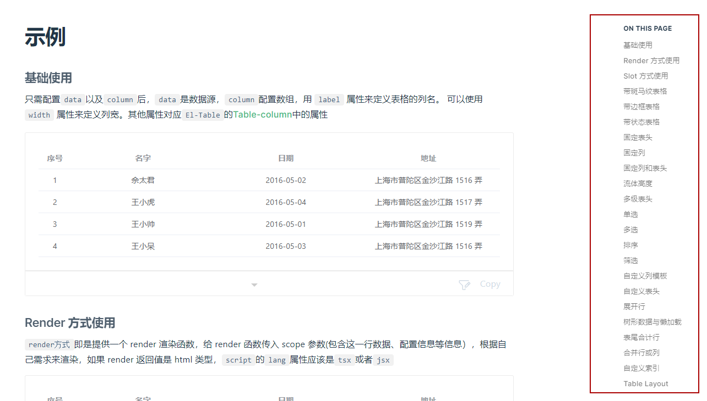

# 基于 Element-plus Table 封装的易用, 一致, 友好的 Vue Table 组件

## Why

用过 [Element UI Table ](https://element-plus.org/en-US/component/table.html)的同学都知道用 Table 组件时需要用到`el-table-column`，它是和 html 混写在一起的, 如果很多列的话，就需要一个个写配置, 否则就需要用到循环。如果列配置内容有根据不同条件展示不同样式内容的话, 就需要在插槽里面做判断, 比如这样两种编辑状态:


比如在插槽里面做配置, 如下代码:

```html
<el-table-column label="操作">
  <template #default="scope">
    <div v-if="scope.row._edit">
      <el-button type="primary" @click="handleSave(scope)"> 保存 </el-button>
      <el-button @click="handleCancle(scope)"> 取消 </el-button>
    </div>
    <el-button v-else type="primary" @click="handleEdit(scope)">
      编辑
    </el-button>
  </template>
</el-table-column>
```

以上这样代码也不算太复杂。
但是假如我们的需求是要切换两个 column 的顺序， 比如:

那应该怎么实现呢, 大概思路就是抽离列配置成为一个 columns 数组, 用 v-for 遍历 columns, 然后在插槽里面做每一列的判断。 通過控制数组顺序来调整列顺序。大概代码思路如下：

[完整的在线 Demo](https://element-plus.run/#eyJBcHAudnVlIjoiPHRlbXBsYXRlPlxuICA8ZWwtYnV0dG9uIEBjbGljaz1cInRvZ2dsZUNvbHVtblNvcnRcIj7kupLmjaLlp5PlkI3kuI7moIfnrb7nmoTpobrluo88L2VsLWJ1dHRvbj5cblxuICA8ZWwtdGFibGUgOmRhdGE9XCJ0YWJsZURhdGFcIj5cbiAgICA8ZWwtdGFibGUtY29sdW1uIHYtZm9yPVwiY29sdW1uIGluIGNvbHVtbnNcIiA6cHJvcD1cImNvbHVtbi5wcm9wXCIgOmxhYmVsPVwiY29sdW1uLmxhYmVsXCI+XG4gICAgICA8dGVtcGxhdGUgI2RlZmF1bHQ9XCJzY29wZVwiPlxuICAgICAgICA8ZGl2IHYtaWY9XCJjb2x1bW4ucHJvcCA9PT0gJ25hbWUnXCI+XG4gICAgICAgICAgPGVsLWlucHV0XG4gICAgICAgICAgICB2LWlmPVwic2NvcGUucm93Ll9lZGl0XCJcbiAgICAgICAgICAgIHYtbW9kZWw9XCJzY29wZS5yb3dbc2NvcGUuY29sdW1uLnByb3BlcnR5XVwiXG4gICAgICAgICAgPjwvZWwtaW5wdXQ+XG4gICAgICAgICAgPHNwYW4gdi1lbHNlPnt7IHNjb3BlLnJvd1tzY29wZS5jb2x1bW4ucHJvcGVydHldIH19PC9zcGFuPlxuICAgICAgICA8L2Rpdj5cbiAgICAgICAgPGRpdiB2LWlmPVwiY29sdW1uLnByb3AgPT09ICd0YWcnXCI+XG4gICAgICAgICAgPGVsLXNlbGVjdFxuICAgICAgICAgICAgdi1pZj1cInNjb3BlLnJvdy5fZWRpdFwiXG4gICAgICAgICAgICB2LW1vZGVsPVwic2NvcGUucm93W3Njb3BlLmNvbHVtbi5wcm9wZXJ0eV1cIlxuICAgICAgICAgICAgc3R5bGU9XCJ3aWR0aDogMTIwcHhcIlxuICAgICAgICAgID5cbiAgICAgICAgICAgIDxlbC1vcHRpb25cbiAgICAgICAgICAgICAgdi1mb3I9XCJvcHRpb24gaW4gdGFnT3B0aW9uc1wiXG4gICAgICAgICAgICAgIDpsYWJlbD1cIm9wdGlvbi5sYWJlbFwiXG4gICAgICAgICAgICAgIDp2YWx1ZT1cIm9wdGlvbi52YWx1ZVwiXG4gICAgICAgICAgICA+PC9lbC1vcHRpb24+XG4gICAgICAgICAgPC9lbC1zZWxlY3Q+XG4gICAgICAgICAgPGVsLXRhZyB2LWVsc2UgOnR5cGU9XCJzY29wZS5yb3cudGFnID09PSAn5a62JyA/ICdpbmZvJyA6ICdzdWNjZXNzJ1wiPlxuICAgICAgICAgICAge3sgc2NvcGUucm93LnRhZyB9fVxuICAgICAgICAgIDwvZWwtdGFnPlxuICAgICAgICA8L2Rpdj5cbiAgICAgIDwvdGVtcGxhdGU+XG4gICAgPC9lbC10YWJsZS1jb2x1bW4+XG4gICAgPGVsLXRhYmxlLWNvbHVtbiBsYWJlbD1cIuaTjeS9nFwiPlxuICAgICAgPHRlbXBsYXRlICNkZWZhdWx0PVwic2NvcGVcIj5cbiAgICAgICAgPGRpdiB2LWlmPVwic2NvcGUucm93Ll9lZGl0XCI+XG4gICAgICAgICAgPGVsLWJ1dHRvbiB0eXBlPVwicHJpbWFyeVwiIEBjbGljaz1cImhhbmRsZVNhdmUoc2NvcGUpXCI+IOS/neWtmCA8L2VsLWJ1dHRvbj5cbiAgICAgICAgICA8ZWwtYnV0dG9uIEBjbGljaz1cImhhbmRsZUNhbmNsZShzY29wZSlcIj4g5Y+W5raIIDwvZWwtYnV0dG9uPlxuICAgICAgICA8L2Rpdj5cbiAgICAgICAgPGVsLWJ1dHRvbiB2LWVsc2UgdHlwZT1cInByaW1hcnlcIiBAY2xpY2s9XCJoYW5kbGVFZGl0KHNjb3BlKVwiPiDnvJbovpEgPC9lbC1idXR0b24+XG4gICAgICA8L3RlbXBsYXRlPlxuICAgIDwvZWwtdGFibGUtY29sdW1uPlxuICA8L2VsLXRhYmxlPlxuPC90ZW1wbGF0ZT5cbjxzY3JpcHQgc2V0dXAgbGFuZz1cInRzXCI+XG5pbXBvcnQgeyByZWYgfSBmcm9tIFwidnVlXCI7XG5jb25zdCBoYW5kbGVFZGl0ID0gKHNjb3BlKSA9PiB7XG4gIHNjb3BlLnJvdy5fcHJlX2RhdGEgPSBKU09OLnN0cmluZ2lmeShzY29wZS5yb3cpO1xuICBzY29wZS5yb3cuX2VkaXQgPSB0cnVlO1xufTtcbmNvbnN0IGhhbmRsZVNhdmUgPSAoc2NvcGUpID0+IHtcbiAgc2NvcGUucm93Ll9lZGl0ID0gZmFsc2U7XG59O1xuY29uc3QgaGFuZGxlQ2FuY2xlID0gKHNjb3BlKSA9PiB7XG4gIE9iamVjdC5hc3NpZ24oc2NvcGUucm93LCB7XG4gICAgLi4uSlNPTi5wYXJzZShzY29wZS5yb3cuX3ByZV9kYXRhKSxcbiAgICBfZWRpdDogZmFsc2UsXG4gICAgX3ByZV9kYXRhOiBudWxsLFxuICB9KTtcbn07XG5jb25zdCB0YWdPcHRpb25zID0gW1xuICB7XG4gICAgbGFiZWw6IFwi5a62XCIsXG4gICAgdmFsdWU6IFwi5a62XCIsXG4gIH0sXG4gIHtcbiAgICBsYWJlbDogXCLlhazlj7hcIixcbiAgICB2YWx1ZTogXCLlhazlj7hcIixcbiAgfSxcbl07XG5cbmNvbnN0IHRhYmxlRGF0YSA9IHJlZihbXG4gIHtcbiAgICBkYXRlOiBcIjIwMTYvNS8xXCIsXG4gICAgbmFtZTogXCLnjovlsI/omY4xXCIsXG4gICAgdGFnOiBcIuWutlwiLFxuICB9LFxuICB7XG4gICAgZGF0ZTogXCIyMDE2LzUvMlwiLFxuICAgIG5hbWU6IFwi546L5bCP6JmOMlwiLFxuICAgIHRhZzogXCLlhazlj7hcIixcbiAgfSxcbiAge1xuICAgIGRhdGU6IFwiMjAxNi81LzNcIixcbiAgICBuYW1lOiBcIueOi+Wwj+iZjjNcIixcbiAgICB0YWc6IFwi5YWs5Y+4XCIsXG4gIH0sXG5dKTtcblxuY29uc3QgY29sdW1ucyA9IHJlZihbXG4gIHtcbiAgICBwcm9wOiBcImRhdGVcIixcbiAgICBsYWJlbDogXCLml6XmnJ9cIixcbiAgfSxcbiAge1xuICAgIHByb3A6IFwibmFtZVwiLFxuICAgIGxhYmVsOiBcIuWnk+WQjVwiLFxuICB9LFxuICB7XG4gICAgcHJvcDogXCJ0YWdcIixcbiAgICBsYWJlbDogXCLmoIfnrb5cIixcbiAgfSxcbl0pO1xuY29uc3QgdG9nZ2xlQ29sdW1uU29ydCA9ICgpID0+IHtcbiAgY29sdW1ucy52YWx1ZSA9IFtcbiAgICAuLi5jb2x1bW5zLnZhbHVlLnNsaWNlKDAsIDEpLFxuICAgIGNvbHVtbnMudmFsdWVbMl0sXG4gICAgY29sdW1ucy52YWx1ZVsxXSxcbiAgICAuLi5jb2x1bW5zLnZhbHVlLnNsaWNlKDMpLFxuICBdO1xufTtcbjwvc2NyaXB0PlxuIiwiaW1wb3J0X21hcC5qc29uIjoie1xuICBcImltcG9ydHNcIjoge31cbn0iLCJfbyI6e319)

```html
<el-table-column
  v-for="column in columns"
  :prop="column.prop"
  :label="column.label"
>
  <template #default="scope">
    <div v-if="column.prop === 'name'">
      <el-input
        v-if="scope.row._edit"
        v-model="scope.row[scope.column.property]"
      ></el-input>
      <span v-else>{{ scope.row[scope.column.property] }}</span>
    </div>
    <div v-if="column.prop === 'tag'">
      <el-select
        v-if="scope.row._edit"
        v-model="scope.row[scope.column.property]"
        style="width: 120px"
      >
        <el-option
          v-for="option in tagOptions"
          :label="option.label"
          :value="option.value"
        ></el-option>
      </el-select>
      <el-tag v-else :type="scope.row.tag === '家' ? 'info' : 'success'">
        {{ scope.row.tag }}
      </el-tag>
    </div>
  </template>
</el-table-column>
```

JS 代码如下:

```js
const columns = ref([
  {
    prop: 'date',
    label: '日期',
  },
  {
    prop: 'name',
    label: '姓名',
  },
  {
    prop: 'tag',
    label: '标签',
  },
]);
const toggleColumnSort = () => {
  columns.value = [
    ...columns.value.slice(0, 1),
    columns.value[2],
    columns.value[1],
    ...columns.value.slice(3),
  ];
};
```

### 痛点

以上代码可以看出一些问题:

- 判断太多, 而且互相嵌套在一块
- 每一列的配置互相耦合,不利于后期的维护
- html 代码和 js 代码混合在一起, 不利于书写

## ElTableNext

为了解决以上问题, 封装了基于 el-table 的 ElTableNext 组件。
以上的代码用 ElTableNext 可以如下实现:

[在线 Demo](https://el-table-next.vercel.app/guide/advanced.html)

```html
<el-table-next :column="column" :data="tableData" />
```

tsx 代码如下:

```js
const column = ref([
  {
    prop: 'date',
    label: '日期',
  },
  {
    prop: 'name',
    label: '姓名',
    render: (value, scope) =>
      scope.row._edit ? (
        <el-input
          model-value={value}
          onUpdate:modelValue={(val) => {
            scope.row[scope.column.property] = val;
          }}
        />
      ) : (
        value
      ),
  },
  {
    prop: 'tag',
    label: '标签',
    render: (value, scope) =>
      scope.row._edit ? (
        <el-select
          model-value={value}
          style='width: 120px'
          onUpdate:modelValue={(val) => {
            scope.row[scope.column.property] = val;
          }}
        >
          {tagOptions.map((option) => (
            <el-option label={option.label} value={option.value}></el-option>
          ))}
        </el-select>
      ) : (
        <el-tag type={scope.row.tag === '家' ? 'info' : 'success'}>
          {value}
        </el-tag>
      ),
  },
]);
const toggleColumnSort = () => {
  column.value = [
    ...column.value.slice(0, 1),
    column.value[2],
    column.value[1],
    ...column.value.slice(3),
  ];
};
```

### 设计原则

1. 完全兼容`el-table` 的原有相关 API 和事件, 方法等, 保持一致。
2. 通过 JSON 来配置列表结构

此外, 增加了一些额外的特性, 提供更好的 typescript 提示。因此封裝的時候，花了很多功夫去折腾 el-table typescript 类型。比如：

1. 
2. 

渲染复杂列内容提供两种方式:

- 一种是插槽 Slot,
- 一种是 render 函数。render 函数的话需要开始`lang="tsx"` tsx 对于熟悉`react`开发者来说，会更加亲切。但是也失去 vue template 提供的便利。比如`v-model`. 你需要自己在`model-value={value}`中设置`value`, 在`onUpdate:modelValue={(val) => {}}`中改变 value 值

看下跳转查看如下 Demo:

1. [render-方式使用](https://el-table-next.vercel.app/guide/example.html#render-%E6%96%B9%E5%BC%8F%E4%BD%BF%E7%94%A8)
2. [slot-方式使用](https://el-table-next.vercel.app/guide/example.html#slot-%E6%96%B9%E5%BC%8F%E4%BD%BF%E7%94%A8)

### 源码封装

本质就是利用 tsx 对 el-table 进行封装, 并且提供了一些额外的特性。对 render `el-table-column` 的時候判断是 slot 还是 render 函数。 总代码量包括类型辅助的代码不超过两百分代码 -- [代码跳转 github](https://github.com/jackluson/el-table-next/blob/main/packages/el-table-next/index.tsx)

ElTableNext 分别实现了官方`el-table` 所有 demo，应该还是比较稳的。



可跳转查看如下 Demo: [https://el-table-next.vercel.app/guide/example.html](https://el-table-next.vercel.app/guide/example.html)

## Other

此外还提供了 [PlayGround](https://jackluson.github.io/el-table-next-playground/) 给小伙伴玩耍
