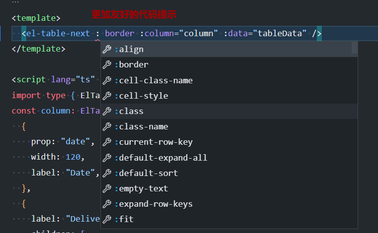

## 安装

### 1. 使用 npm 或 yarn 安装

推荐使用 npm 或 yarn 的方式进行开发，不仅可在开发环境轻松调试，也可放心地在生产环境打包部署使用，享受整个生态圈和工具链带来的诸多好处。

```shell
$ npm install el-table-next --save
```

```shell
$ yarn add el-table-next
```

### 2. 浏览器引入

在浏览器中使用 script 和 link 标签直接引入文件，并使用全局变量 `ElTableNext`。

> 注： `ElTableNext` 是依赖 `element-ui` ,所以务必先要引入 element-ui 相关 js 与 css

## 示例

### 1. 脚手架搭建项目

```javascript
import { createApp } from 'vue';
import 'element-plus/dist/index.css';
import ElementPlus from 'element-plus';
import ElTableNext from 'el-table-next';
import App from './App.vue';

const app = createApp(App);

app.use(ElementPlus).use(ElTableNext);
app.mount('#app');
```

### 2. 使用 CDN 静态页面

```html
<!-- import Vue before Element -->
<script src="https://unpkg.com/vue@3.2.31/dist/vue.global.js"></script>
<!-- import ELEMTN CSS -->
<link
  rel="stylesheet"
  href="https://unpkg.com/element-ui/lib/theme-chalk/index.css"
/>
<!-- import ELMENT JavaScript -->
<script src="https://unpkg.com/element-plus"></script>
<!-- el-table-next  -->
<script src="https://unpkg.com/el-table-next/dist/index.umd.js"></script>
```

[这是一个使用 CDN 引入的 ElTableNext 在线 codesandbox 演示项目](https://codesandbox.io/embed/flamboyant-estrela-udtq3h?fontsize=14&hidenavigation=1&theme=dark)， 如下：

<iframe src="https://codesandbox.io/embed/flamboyant-estrela-udtq3h?fontsize=14&hidenavigation=1&theme=dark"
     style="width:100%; height:500px; border:0; border-radius: 4px; overflow:hidden;"
     title="flamboyant-estrela-udtq3h"
     allow="accelerometer; ambient-light-sensor; camera; encrypted-media; geolocation; gyroscope; hid; microphone; midi; payment; usb; vr; xr-spatial-tracking"
     sandbox="allow-forms allow-modals allow-popups allow-presentation allow-same-origin allow-scripts"
   ></iframe>

## 配置

### 代码提示[Vscode]

1. 
2. 

- **手动配置**

El-Table-Next 作为全局组件如果想获得更加友好的代码提示, 需要在安装 Vscode 插件 [Volar](https://marketplace.visualstudio.com/items?itemName=johnsoncodehk.volar)之后, 在 src 目前下创建一个.d.ts 类型文件, 写入如下代码:

```typescript
declare module 'vue' {
  export interface GlobalComponents {
    ElTableNext: typeof import('el-table-next')['ElTableNext'];
  }
}
export {};
```

- **[unplugin-vue-components](https://github.com/antfu/unplugin-vue-components)配置**

如果项目中用了 unplugin-vue-components 插件的话, 只需要配置多一个 resolvers 就自动生成了 component.d.ts 类型文件

```ts
resolvers: [
  (name) => {
    // where `name` is always CapitalCase
    if (name === 'ElTableNext') {
      return { importName: name, path: 'el-table-next' };
    }
  },
],
```
